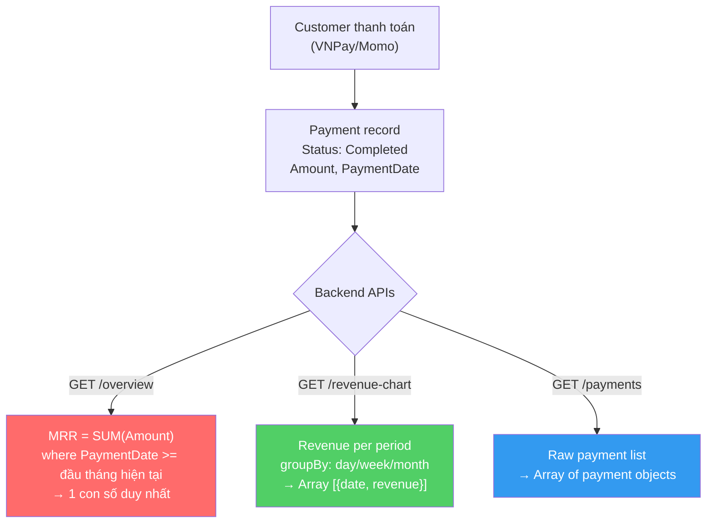

# Phân Tích Backend MRR & Gợi Ý Biểu Đồ Frontend

## 1. Tổng Quan Kiến Trúc Backend

Backend gồm **Saas Service** (port `5004`) cung cấp SuperAdmin Dashboard APIs:
- Route prefix: `api/super-admin/saas/dashboard`
- Auth: `[Authorize(Roles = "SuperAdmin")]` — yêu cầu JWT token với role SuperAdmin
- Caching: Redis, cache 5–10 phút

---

## 2. Chi Tiết Tất Cả Endpoints Liên Quan MRR/Revenue

### 2.1. `GET /api/super-admin/saas/dashboard/overview`

**Mục đích:** Tổng quan dashboard — MRR, doanh thu, số cửa hàng, tỷ lệ chuyển đổi.

**Request:**
- Method: `GET`
- Auth: Bearer JWT (SuperAdmin)
- Query Params: Không có
- Cache: 10 phút (`superadmin:dashboard:overview`)

**Response:**
```json
{
  "success": true,
  "data": {
    "totalRevenue": 15000000.0,
    "monthlyRecurringRevenue": 499000.0,
    "activeStores": 25,
    "trialStores": 120,
    "expiredStores": 15,
    "trialToPaidConversionRate": 17.24
  }
}
```

**Luồng tính MRR trong code:**
```csharp
// File: SuperAdminDashboardService.cs (line 25-29)
var firstDayOfMonth = new DateTime(DateTime.UtcNow.Year, DateTime.UtcNow.Month, 1, 0, 0, 0, DateTimeKind.Utc);
var mrr = await _db.Payments
    .Where(p => p.Status == "Completed" && p.PaymentDate >= firstDayOfMonth)
    .Select(p => (decimal?)p.Amount)
    .SumAsync() ?? 0;
```

> [!IMPORTANT]
> **MRR ở đây = Tổng `Amount` của tất cả Payment có `Status == "Completed"` từ ngày 1 tháng hiện tại (UTC) đến now.**
> Đây là một con số duy nhất (scalar), KHÔNG phải time-series. Không có dữ liệu MRR theo từng ngày/tuần/tháng.

---

### 2.2. `GET /api/super-admin/saas/dashboard/revenue-chart` ⭐ KEY ENDPOINT

**Mục đích:** Biểu đồ doanh thu theo thời gian — **đây là endpoint quan trọng nhất cho biểu đồ**.

**Request:**
- Method: `GET`
- Auth: Bearer JWT (SuperAdmin)
- Query Params:

| Param | Type | Default | Mô tả |
|-------|------|---------|-------|
| `from` | `DateTime?` | `now - 12 months` | Ngày bắt đầu |
| `to` | `DateTime?` | `DateTime.UtcNow` | Ngày kết thúc |
| `groupBy` | `string` | `"month"` | `"day"`, `"week"`, `"month"` |

- Cache: 10 phút (`superadmin:dashboard:revenue:{from}:{to}:{groupBy}`)

**Response:**
```json
{
  "success": true,
  "data": [
    { "date": "2026-01", "revenue": 499000.0 },
    { "date": "2026-02", "revenue": 998000.0 },
    { "date": "2026-03", "revenue": 1497000.0 },
    { "date": "2026-04", "revenue": 499000.0 }
  ]
}
```

**Luồng trong code:**
```csharp
// File: SuperAdminDashboardService.cs (line 67-89)
var payments = await _db.Payments
    .Where(p => p.Status == "Completed" && p.PaymentDate >= from && p.PaymentDate <= to)
    .Select(p => new { p.PaymentDate, p.Amount })
    .ToListAsync();

// Nhóm theo groupBy:
// "month" → format "2026-04"
// "week"  → format "2026-W14"
// "day"   → format "2026-04-07"
```

> [!IMPORTANT]
> Endpoint này trả về **Revenue** (doanh thu payment), KHÔNG phải MRR theo nghĩa SaaS (recurring). Nhưng vì model thanh toán hiện tại là subscription monthly → **mỗi payment = 1 tháng subscription = MRR contribution**.

---

### 2.3. `GET /api/super-admin/saas/dashboard/payments`

**Mục đích:** Danh sách tất cả payments — có thể dùng để frontend tự tính toán nếu cần.

**Request:**
- Method: `GET`
- Auth: Bearer JWT (SuperAdmin)
- Query Params:

| Param | Type | Mô tả |
|-------|------|-------|
| `status` | `string?` | Filter: `"Completed"`, `"Pending"`, etc. |
| `from` | `DateTime?` | Từ ngày |
| `to` | `DateTime?` | Đến ngày |

**Response:**
```json
{
  "success": true,
  "data": [
    {
      "id": "guid...",
      "storeName": "Shop ABC",
      "planName": "Professional",
      "amount": 499000.0,
      "status": "Completed",
      "provider": "VNPay",
      "paymentDate": "2026-04-01T10:30:00Z",
      "transactionCode": "TXN123456"
    }
  ]
}
```

> [!NOTE]
> Endpoint này trả về raw data chi tiết từng payment. Frontend có thể dùng để group/calculate MRR nếu cần (nhưng nặng hơn `revenue-chart`).

---

### 2.4. `GET /api/super-admin/saas/dashboard/plan-distribution`

**Mục đích:** Phân phối gói plan (bao nhiêu store dùng gói nào).

**Response:**
```json
{
  "success": true,
  "data": [
    { "planName": "Basic", "count": 50 },
    { "planName": "Professional", "count": 25 },
    { "planName": "Enterprise", "count": 5 }
  ]
}
```

---

### 2.5. Các endpoints khác (cho ngữ cảnh)

| Endpoint | Method | Mô tả |
|----------|--------|-------|
| `/api/super-admin/saas/dashboard/stores` | GET | Chi tiết tất cả stores |
| `/api/super-admin/saas/dashboard/subscriptions` | GET | Tất cả subscriptions (`?status=&planId=`) |
| `/api/super-admin/saas/dashboard/subscriptions/{id}/cancel` | PUT | Hủy subscription |
| `/api/super-admin/saas/dashboard/subscriptions/{id}/extend` | PUT | Gia hạn (`{ "days": 30 }`) |

---

## 3. Luồng Data MRR — Hiện Trạng



---

## 4. Gợi Ý Thiết Kế Biểu Đồ MRR Cho Frontend (Không Sửa Backend)

> [!IMPORTANT]
> **Kết luận quan trọng:** Backend đã có endpoint `revenue-chart` trả về **doanh thu theo time-series** (day/week/month). Đây chính là data để vẽ biểu đồ "MRR trend". Không cần sửa backend!

### Phương án 1: Dùng `revenue-chart` trực tiếp (✅ KHUYẾN NGHỊ)

**Lý do:** Vì mỗi payment trong hệ thống 360Retail đều gắn với subscription monthly → `Revenue per month ≈ MRR of that month`.

```
GET /api/super-admin/saas/dashboard/revenue-chart?groupBy=month&from=2025-04-01&to=2026-04-07
```

**Response sẽ trả về:**
```json
[
  { "date": "2025-04", "revenue": 0 },
  { "date": "2025-05", "revenue": 499000 },
  { "date": "2025-06", "revenue": 998000 },
  ...
  { "date": "2026-04", "revenue": 499000 }
]
```

**Frontend implementation:**
```tsx
// Gọi API
const { data } = await api.get('/super-admin/saas/dashboard/revenue-chart', {
  params: { groupBy: 'month', from: '2025-04-01' }
});

// data.data = [{ date: "2025-04", revenue: 0 }, ...]
// Dùng Recharts vẽ Area/Line chart
<AreaChart data={data.data}>
  <XAxis dataKey="date" />
  <YAxis tickFormatter={(v) => formatCurrency(v)} />
  <Tooltip formatter={(v) => formatCurrency(v)} />
  <Area dataKey="revenue" name="MRR" fill="url(#gradient)" stroke="#3b82f6" />
</AreaChart>
```

**Label trên chart:** Gọi là **"Doanh thu định kỳ hàng tháng (MRR)"** hoặc **"Monthly Revenue"**.

---

### Phương án 2: Kết hợp `overview` + `revenue-chart`

Hiển thị **KPI card** + **Chart** cùng lúc:

| Component | Data Source | Hiển thị |
|-----------|-----------|----------|
| **KPI Card "MRR"** | `GET /overview` → `monthlyRecurringRevenue` | `499.000 ₫` (tháng hiện tại) |
| **MRR Trend Chart** | `GET /revenue-chart?groupBy=month` | Line/Area chart 12 tháng |
| **Revenue Daily** | `GET /revenue-chart?groupBy=day&from=2026-04-01` | Bar chart chi tiết trong tháng |

**Layout gợi ý:**
```
┌─────────────────────────────────────────────────────────┐
│  MRR Tháng Này        │  Tổng Doanh Thu    │  Stores   │
│  ₫499.000 ▲           │  ₫15.000.000       │  25 🟢    │
│  (from /overview)     │  (from /overview)  │           │
├─────────────────────────────────────────────────────────┤
│                                                         │
│  📈 MRR Trend (12 tháng gần nhất)                      │
│  ┌──────────────────────────────────────────┐           │
│  │          ╱─────╲                         │           │
│  │    ╱────╱       ╲────╱──                 │           │
│  │ ──╱                                      │           │
│  │ Apr May Jun ... Mar Apr                  │           │
│  └──────────────────────────────────────────┘           │
│  (from /revenue-chart?groupBy=month)                    │
│                                                         │
│  Toggle: [Ngày] [Tuần] [Tháng]  ← Thay đổi groupBy    │
│                                                         │
├─────────────────────────────────────────────────────────┤
│  📊 Revenue chi tiết tháng này (by day)                 │
│  ┌──────────────────────────────────────────┐           │
│  │ ░░ ░░░ ░░░░ ░░ ░░░ ...                  │           │
│  │ 01 02  03   04 05                        │           │
│  └──────────────────────────────────────────┘           │
│  (from /revenue-chart?groupBy=day&from=2026-04-01)     │
│                                                         │
└─────────────────────────────────────────────────────────┘
```

---

### Phương án 3: Dùng `payments` endpoint để tính MRR chính xác hơn (Advanced)

Nếu muốn phân biệt "New MRR", "Expansion MRR", "Churn MRR" thì frontend có thể:

```
GET /api/super-admin/saas/dashboard/payments?status=Completed&from=2025-01-01
```

Rồi tự group trên client-side:
```ts
// Group payments by month
const mrrByMonth = payments.reduce((acc, payment) => {
  const month = payment.paymentDate.substring(0, 7); // "2026-04"
  acc[month] = (acc[month] || 0) + payment.amount;
  return acc;
}, {});
```

> [!WARNING]
> Cách này nặng hơn vì download toàn bộ raw payments. Chỉ dùng khi cần logic phân tích phức tạp.

---

## 5. Tóm Tắt Quyết Định

| Câu hỏi | Trả lời |
|----------|---------|
| Backend có MRR time-series không? | ❌ Không có endpoint riêng cho "MRR trend" |
| Backend có Revenue time-series không? | ✅ CÓ — `revenue-chart` endpoint |
| Revenue ≈ MRR? | ✅ Vì model thanh toán là monthly subscription |
| Frontend vẽ biểu đồ được không? | ✅ **CÓ — dùng `revenue-chart?groupBy=month`** |
| Cần sửa backend không? | ❌ **KHÔNG CẦN** |

> [!TIP]
> **Kết luận: Frontend HOÀN TOÀN có thể vẽ biểu đồ MRR trend mà KHÔNG cần sửa backend.** Sử dụng endpoint `GET /revenue-chart?groupBy=month` để lấy doanh thu theo tháng. Vì 360Retail sử dụng model subscription monthly, nên Revenue per month = MRR of that month.
